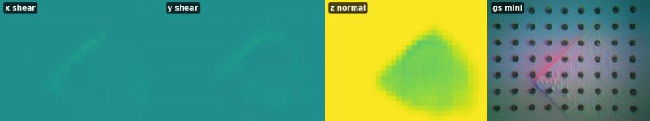

# feats

<!-- PROJECT LOGO -->
<br />
<div align="center">
  <a href="https://github.com/feats-ai/feats">
    
  </a>

  <h3 align="center">FEATS -- Finite Element Analysis for Tactile Sensing</h3>
  <h5 align="center">Erik Helmut*, Luca Dziarski*, Niklas Funk, Boris Belousov, Jan Peters<br><em>*Equal contribution</em></h5>

  <p align="center">
    This repository provides the code for the work on <a href="https://arxiv.org/abs/2411.03315">Learning Force Distribution Estimation for the GelSight Mini Optical Tactile Sensor Based on Finite Element Analysis</a>. FEATS is a machine learning approach using a U-net architecture to predict contact force distributions directly from the GelSight Mini's raw images. Our model, trained on force distributions inferred from Finite Element Analysis (FEA), demonstrates promising accuracy in predicting normal and shear force distributions. It also shows potential for generalization across indenters, sensors of the same type, and for enabling real-time application.
    <br />
    <a href="https://feats-ai.github.io"><strong>For more information about FEATS, visit the project page »</strong></a> <br />
  </p>
</div>


```
@misc{helmut_dziarski2025feats,
      title={Learning Force Distribution Estimation for the GelSight Mini Optical Tactile Sensor Based on Finite Element Analysis}, 
      author={Erik Helmut and Luca Dziarski and Niklas Funk and Boris Belousov and Jan Peters},
      year={2025},
      eprint={2411.03315},
      archivePrefix={arXiv},
      primaryClass={cs.RO},
      url={https://arxiv.org/abs/2411.03315}, 
}
```

<!-- TABLE OF CONTENTS -->
<details>
      <summary>Table of Contents</summary>
            <ol>
            <li>
                  <a href="#introduction">Introduction</a>
            </li>
            <li>
                  <a href="#getting-started">Getting Started</a>
                  <ol>
                  <li><a href="#prerequisites">Prerequisites</a></li>
                  <li><a href="#installation">Installation</a></li>
                  </ol>
            </li>
            <li>
                  <a href="#usage">Usage</a>
                  <ol>
                  <li><a href="#general-repository-structure">General Repository Structure</a></li>
                  <li><a href="#downloading-the-dataset">Downloading the Dataset</a></li>
                  <li><a href="#running-feats-demo-on-gelsight-mini-sensor">Running FEATS Demo on GelSight Mini Sensor</a></li>
                  <li><a href="#calibration">Calibration</a></li>
                  </ol>
            </li>
            <li>
                  <a href="#license">License</a>
            </li>
            <li>
                  <a href="#questions-and-contributing">Questions and Contributing</a>
            </li>
            </ol>
</details>


<!-- Introduction -->
## Introduction
Welcome to the FEATS repository. This repository provides the code for training and evaluating the U-net model on the FEATS dataset. The dataset consists of shear and normal force distributions, which were inferred from FEA. The model is trained to predict the shear and normal force distributions directly from the GelSight Mini's raw images. The code is mostly written in Python and uses PyTorch for training and evaluation. In addition, the repository contains the code for data collection, setting up the FEA simulations with CalculiX and the label generation pipeline.

We hope that this repository will be useful for researchers and practitioners interested in tactile sensing, force estimation, and machine learning. 


<!-- Getting Started -->
## Getting Started

<!-- Prerequisites -->
### Prerequisites
Make sure you have a working Python environment. The code was tested with Python 3.11.10, but should also work with newer versions. We recommend using a virtual environment to manage the dependencies. 

<!-- Installation -->
### Installation

#### Step 1: Clone the repository
Clone the repository into the `src` folder of your catkin workspace.

```console
$ cd ~
$ git clone https://github.com/feats-ai/feats.git
$ cd feats
```

#### Step 2: Create a virtual environment
```console
$ python3 -m venv venv
$ source venv/bin/activate
```

#### Step 3: Install dependencies
```console
$ pip3 install -r requirements.txt
```


<!-- Usage -->
## Usage

<!-- General Repository Structure -->
### General Repository Structure
The source code of this repository is structured into different subfolders, each containing code for a specific part of the project. The main structure is as follows:

```
📂 CalculiX/            # CalculiX binaries
📂 src/                 # source code
      📂 calculix/      # Files related to FEA with calculix (e.g. Geometries/Meshes)
      📂 feats/         # Files related to training U-net (e.g. data preparation, NN models)
      📂 linuxcnc/      # Files related to controlling the CNC milling machine and reading data from the sensors
```

Each subfolder contains a README file with further instructions on how the folder is structured and what the contained files are used for.

<!-- Downloading the Dataset -->
### Downloading the Dataset
The dataset used in this work is available for download [here](https://drive.google.com/drive/folders/1kxUcK0YcSiE9qeQPsUWe_fNc_h1WPYkS?usp=sharing). The dataset consists of GelSight Mini images with shear and normal force distributions labels, which were inferred from FEA. The dataset is split into training, validation, and test sets. The dataset is stored as `.npy` files, which can be loaded using the `numpy` library in Python. Make sure to use numpy version 2.X or higher to load the dataset.

Place the downloaded dataset in the [`src/feats/data`](src/feats/data) folder. If you want to train or visualize predictions on the dataset, you can use the provided scripts in the [`src/feats/src`](src/feats/src) folder. You just need to adjust the paths in the config files to point to the correct dataset location.

<!-- Running FEATS Demo on GelSight Mini Sensor -->
### Running FEATS Demo on GelSight Mini Sensor
If you want to test the model on your own GelSight Mini sensor, you can use the provided pre-trained modesl. The models are located in the [`src/feats/models`](src/feats/models) folder. A simple demo script is provided in the [`src/feats/src/predict`](src/feats/src/predict) folder. Inside the [`predict`](src/feats/src/predict) folder, you will also find a [`predict_config.yaml`](src/feats/src/predict/predict_config.yaml) file that contains the configuration for inference, e.g., the path to the model and normalization file.

Make sure to connect your GelSight Mini sensor (with a dotted gel), to your computer. You can then run the demo script with the following command:

```console
$ cd src/feats/src/predict
$ python3 predict.py --config predict_config.yaml
```

Note that the prediction results can vary depending on the GelSight Mini sensor you are using. This can have several factors, including differences in the alignment of the camera relative to the gel, and sensor-related factors such as image brightness, contrast, saturation, and hue.

<!-- Calibration -->
### Calibration
We provide a calibration script that can help to make the predictions better. The calibration script is located in the [`src/feats/scripts`](src/feats/scripts) folder. Again, make sure to connect your GelSight Mini sensor to your computer. You can then run the calibration script with the following command:

```console
$ python3 calibrate_sensor.py
```

The calibration script will save the calibration file in the [`src/feats/calibration`](src/feats/calibration) folder. You can then choose this calibration file in the [`predict_config.yaml`](src/feats/src/predict/predict_config.yaml) file to improve the predictions.


<!-- License -->
## License
This project is licensed under the MIT License. See [`LICENSE`](LICENSE) for more information.


<!-- Questions and Contributing -->
## Questions and Contributing
If you have any questions or need help with running the code, please create an <a href="https://github.com/feats-ai/feats/issues/new/">issue</a>.

We also welcome contributions to this repository, including bug fixes or other improvements. If you would like to contribute, please <a href="https://github.com/feats-ai/feats/fork">fork</a> this repository and submit a <a href="https://github.com/feats-ai/feats/compare">pull request</a> with your changes, or reach out to erik.helmut1 [at] gmail [dot] de.
